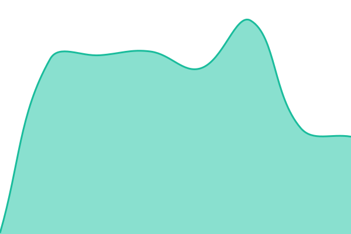

# [📈 Live Status](https://status.goletro.com): <!--live status--> **🟧 Partial outage**

This repository contains the open-source uptime monitor and status page for [Goletro Technologies](https://goletro.com/), powered by [Upptime](https://github.com/upptime/upptime).

With [Upptime](https://upptime.js.org), you can get your own unlimited and free uptime monitor and status page, powered entirely by a GitHub repository. We use [Issues](https://github.com/goletro/status/issues) as incident reports, [Actions](https://github.com/goletro/status/actions) as uptime monitors, and [Pages](https://status.goletro.com) for the status page.

<!--start: status pages-->
<!-- This summary is generated by Upptime (https://github.com/upptime/upptime) -->
<!-- Do not edit this manually, your changes will be overwritten -->
<!-- prettier-ignore -->
| URL | Status | History | Response Time | Uptime |
| --- | ------ | ------- | ------------- | ------ |
|  [GoPanel App](https://app.goletro.com) | 🟩 Up | [go-panel-app.yml](https://github.com/goletro/status/commits/HEAD/history/go-panel-app.yml) | 

 1254ms
     
 | 

<a href="https://status.goletro.com/history/go-panel-app">100.00%</a>
    

|  [GoPanel API & Database](https://app.goletro.com/api/status) | 🟥 Down | [go-panel-api-and-database.yml](https://github.com/goletro/status/commits/HEAD/history/go-panel-api-and-database.yml) | 

 306ms
     
 | 

<a href="https://status.goletro.com/history/go-panel-api-and-database">22.59%</a>
    

|  [Goletro Website](https://goletro.com) | 🟩 Up | [goletro-website.yml](https://github.com/goletro/status/commits/HEAD/history/goletro-website.yml) | 

 1956ms
     
 | 

<a href="https://status.goletro.com/history/goletro-website">100.00%</a>
    

|  [Supabase Database](https://qgtmocvjdtohyqwpgwsh.supabase.co/rest/v1/) | 🟩 Up | [supabase-database.yml](https://github.com/goletro/status/commits/HEAD/history/supabase-database.yml) | 

 169ms
     
 | 

<a href="https://status.goletro.com/history/supabase-database">100.00%</a>
    

<!--end: status pages-->

[**Visit our status website →**](https://status.goletro.com)

## 📄 License

- Powered by: [Upptime](https://github.com/upptime/upptime)
- Code: [MIT](./LICENSE) © [Anand Chowdhary](https://anandchowdhary.com), supported by [Pabio](https://pabio.com)
- Data in the `./history` directory: [Open Database License](https://opendatacommons.org/licenses/odbl/1-0/)
